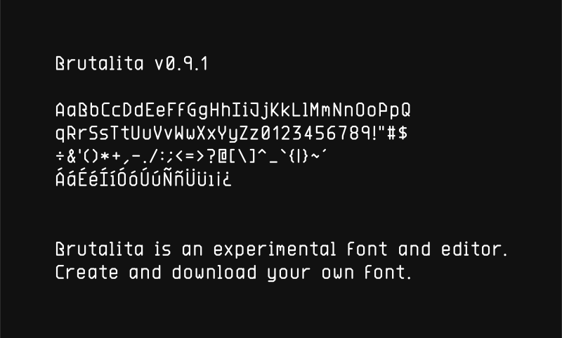

# Brutalita

[](https://brutalita.com/)

Brutalita is an experimental font and font editor, edit in your browser and download OTF.

The name means "little brutal" in spanish. Made with SVG and Opentype.JS

- Download Brutalita: https://brutalita.com/Brutalita-400.otf

## CLI

Compile a font source to `.otf` without opening the editor. The source is the
same JSON the editor exports — `{ "config": {...}, "chars": {...} }` — where
each glyph is a list of polylines on a 2×4 half-step grid.

```sh
pnpm dlx brutalita build my-font.json -o MyFont.otf
```

With no source argument it looks for `./font.json`, then `./src/font.json`, then
falls back to the copy of Brutalita bundled with the CLI.

### Commands

| Command | What it does |
| --- | --- |
| `build` | Compile a font source to `.otf` |
| `render` | Render text to a single-stroke `.svg` |
| `validate` | Check a font source for errors |
| `info` | Describe a font source, or read a built `.otf` back |
| `init` | Create a starter font source |
| `watch` | Rebuild whenever the source changes |

Run `brutalita help <command>` for the full option list.

```sh
# every weight at once, into a directory
brutalita build src/font.json -d public -w all --filename "Brutalita-{weight}.{ext}"

# pipe the bytes somewhere else
brutalita build src/font.json -w 700 -o - > Bold.otf

# a specimen image
brutalita render src/font.json -t "Hello\nWorld" --background "#111" --width 800 -o hello.svg

# check a font you are editing by hand
brutalita validate my-font.json --strict
brutalita info my-font.json
```

Diagnostics always go to stderr, so `--out -` and `--json` stay pipeable.
Exit codes: `0` success, `1` usage or I/O error, `2` invalid font source.

### Reproducible builds

`opentype.js` stamps `head.created` and `head.modified` with the current time, so
two builds of an unchanged source differ. Pass `--timestamp` to pin both and get
byte-identical output:

```sh
brutalita build src/font.json -o Brutalita.otf --timestamp 2024-01-01
```

## Development

```sh
pnpm dev         # the editor at localhost:3000
pnpm cli         # run the CLI from source
pnpm fonts       # regenerate public/Brutalita-{300,400,700}.otf
pnpm cover       # regenerate the banner above
pnpm test        # unit tests + golden font/SVG regression tests
pnpm typecheck
pnpm build:cli   # bundle the CLI to dist/cli/brutalita.mjs
```

The CLI bundles to a single dependency-free file, so `dist/cli/brutalita.mjs` is
the only thing published. The font-building core (`src/font-maker.ts`,
`src/svg-export.ts`, `src/font-validate.ts`) is shared with the browser editor
and stays free of DOM access.
